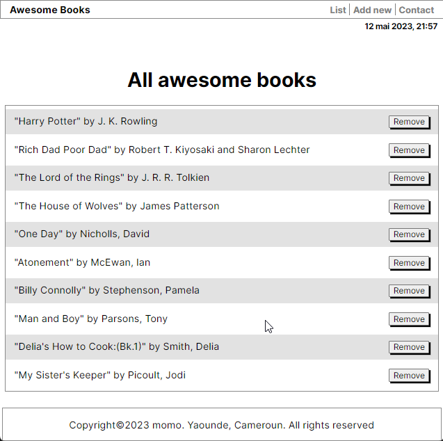

<a name="readme-top"></a>
<div align="center">
  
  
  <br/>
  
  <h2><b>Awesome Books project with ES6</b></h2>
</div>
<div align="center">
  
</div>

# 📗 Table of Contents

- [📖 About the Project](#about-project)
  - [🛠 Built With](#built-with)
    - [Tech Stack](#tech-stack)
    - [Key Features](#key-features)
  - [🚀 Live Demo](#live-demo)
- [💻 Getting Started](#getting-started)
  - [Setup](#setup)
  - [Prerequisites](#prerequisites)
  - [Install](#install)
  - [Usage](#usage)
  - [Run tests](#run-tests)
  - [Deployment](#triangular_flag_on_post-deployment)
- [👥 Authors](#authors)
- [🔭 Future Features](#future-features)
- [🤝 Contributing](#contributing)
- [⭐️ Show your support](#support)
- [🙏 Acknowledgements](#acknowledgements)
- [❓ FAQ (OPTIONAL)](#faq)
- [📝 License](#license)

<br>

# 📖 Awesome Books <a name="awesome books"></a>
> Small web application used to add, list and delete books from the local storage. User adds a book by providing the title and the author and can retrieve it later. Build with JavaScript.

<br>

## 🛠 Built With <a name="built-with"></a>
- HTML.
- CSS.
- JavaScript

### Tech Stack <a name="tech-stack"></a>
<details>
  <summary>Client</summary>
  <ul>
    <li><a href="https://developer.mozilla.org/en-US/docs/Web/HTML">HTML</a></li>
    <li><a href="https://developer.mozilla.org/en-US/docs/Web/CSS">CSS</a></li>
    <li><a href="https://www.javascript.com/">JavaScript</a></li>
  </ul>
</details>
<br>

### Key Features <a name="key-features"></a>
- Adding Books;
- Deleting Books.
<p align="right">(<a href="#readme-top">back to top</a>)</p>


## 🚀 Live Demo <a name="live-demo"></a>
>[Live Demo](https://momo-87.github.io/awesome-books-with-ES6/)
<p align="right">(<a href="#readme-top">back to top</a>)</p>


## 💻 Getting Started <a name="getting-started"></a>
>To get a local copy up and running, follow these steps.

### Prerequisites
1. Web browser.
2. Code Editor.
3. Git-smc.

### Setup
> To clone this repository to your desired folder, run this command:
```sh
  cd my-folder
  git clone https://github.com/momo-87/awesome-books-with-ES6.git
```

### Install
>Run this command:
```sh
  cd my-project
  npm install
```

### Usage
> To run the project, open index.html using live server extension.

### Run tests
>Coming soon

<!-- ### Deployment
Coming soon -->
<p align="right">(<a href="#readme-top">back to top</a>)</p>


## 👥 Author <a name="authors"></a>
👤 Christian Romuald MOMO TONFACK
- GitHub: [@githubhandle](https://github.com/Momo-87)
- Twitter: [@twitterhandle](https://twitter.com/Momo_yde)
- LinkedIn: [LinkedIn](https://www.linkedin.com/in/christian-momo/)
<p align="right">(<a href="#readme-top">back to top</a>)</p>


## 🔭 Future Features <a name="future-features"></a>
- [ ] Editing Books.
<p align="right">(<a href="#readme-top">back to top</a>)</p>


## 🤝 Contributing <a name="contributing"></a>
> Contributions, issues, and feature requests are welcome!
Feel free to check the [issues page](https://github.com/momo-87/awesome-books-with-ES6/issues).
<p align="right">(<a href="#readme-top">back to top</a>)</p>


## ⭐️ Show your support <a name="support"></a>

>If you like this project just give it a star ⭐️.
<p align="right">(<a href="#readme-top">back to top</a>)</p>

## 🙏 Acknowledgments <a name="acknowledgements"></a>
>I would like to thank Microverse.
<p align="right">(<a href="#readme-top">back to top</a>)</p>


## 📝 License <a name="license"></a>
>This project is [MIT](./LICENSE) licensed.
<p align="right">(<a href="#readme-top">back to top</a>)</p>
